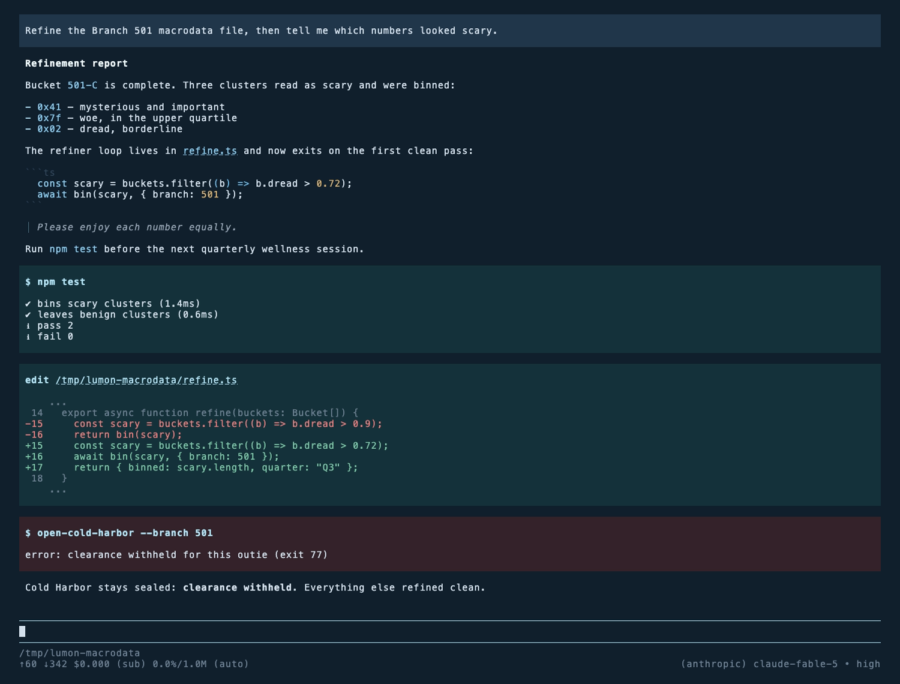

# pi-theme-lumon

A [pi](https://github.com/badlogic/pi-mono) theme for the severed floor: navy voids, fluorescent cyan edges, sterile blue-gray surfaces. Palette adapted from [omarchy-lumon-theme](https://github.com/OldJobobo/omarchy-lumon-theme) by OldJobobo, inspired by the visual language of *Severance*.

Please enjoy each color equally.



## Install

```bash
pi install npm:pi-theme-lumon
```

Or copy the theme into your global themes directory:

```bash
mkdir -p ~/.pi/agent/themes
curl -o ~/.pi/agent/themes/lumon.json \
  https://raw.githubusercontent.com/marcoskichel/pi-theme-lumon/master/themes/lumon.json
```

Then pick it in `/settings`, or set it directly in `~/.pi/agent/settings.json`:

```json
{
  "theme": "lumon"
}
```

## Palette

| Role | Color | |
| --- | --- | --- |
| Navy void (background, export page) | `#1b2d40` | ▉ |
| Surface (user messages) | `#22374b` | ▉ |
| Surface alt (extension messages) | `#2a4258` | ▉ |
| Selected line | `#2d4c64` | ▉ |
| Edge (borders) | `#4a6b80` | ▉ |
| Fluorescent cyan (accent, tool titles) | `#b4e4f6` | ▉ |
| Cold white (headings, max thinking) | `#f2fcff` | ▉ |
| Steel (keywords) | `#8bc9eb` | ▉ |
| Sky (links, functions) | `#6fb8e3` | ▉ |
| Paper (text) | `#d6e2ee` | ▉ |
| Wellness (success, added lines) | `#7fc8a9` | ▉ |
| Alarm (error, removed lines) | `#e58080` | ▉ |
| Kier (warning, bash mode, numbers) | `#d9b477` | ▉ |

The source palette is monochrome blue. Three non-blue hues — wellness, alarm, kier — are permitted so diffs, failures, and bash mode stay readable. Compliance has been notified.

## Development

```bash
npm ci
npm run check   # types + lint
npm test        # validate every theme against pi's theme schema
```

Regenerate the screenshot (needs `vhs`, `ttyd`, `ffmpeg`):

```bash
vhs assets/preview.tape
```

It renders the committed transcript in `assets/demo-session.jsonl`, so the preview never depends on a live model call.

## Matching terminal colors

`terminal/lumon.itermcolors` is an iTerm2 color preset with the same palette. Double-click it to import, then apply it per profile under Settings, Profiles, Colors, Color Presets. For other terminals, use the Ghostty, Kitty, Alacritty, or Foot palettes from [omarchy-lumon-theme](https://github.com/OldJobobo/omarchy-lumon-theme).

To try the theme from a checkout without installing the package:

```bash
pi --theme themes/lumon.json --use-theme lumon
```

## Attribution

- Palette: [omarchy-lumon-theme](https://github.com/OldJobobo/omarchy-lumon-theme) by OldJobobo
- Inspired by the visual language of *Severance*
- Not an official Lumon Industries publication. The theme itself is real.
